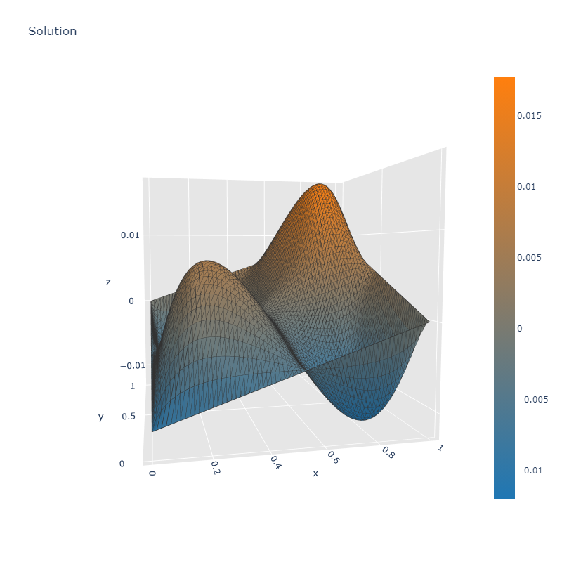

# A simple P1 Finite Element library

Uses Eigen and python

# How to run:

- install python
- download Eigen library
- install numpy (pip install numpy)
- install plotly (pip install plotly)

g++ compiler arguments:
- add Eigen/include to include dependencies
- add Python<*version*>/include to include dependencies
- add Python<*version*>/libs to library paths
- bind python<*version*>.lib and python3.9_d.lib

<*version*> >= 3.9

